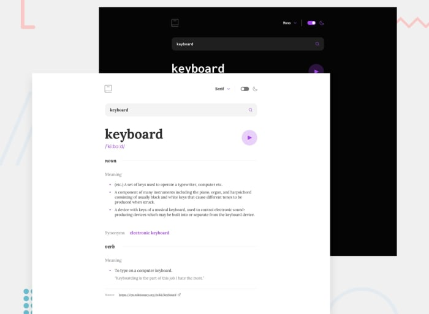

# Dictionary Web App - Frontend Mentor Challenge

## Table of contents

- [Overview](#overview)
  - [The challenge](#the-challenge)
  - [Screenshot](#screenshot)
  - [Built with](#built-with)
- [Acknowledgments](#acknowledgments)

## Overview

### The challenge

This task involves utilizing an API to fetch definitions of words from a dictionary and presenting them. The chosen API for this purpose is dictionaryapi.dev.

Executing this API call is straightforward, but the response format presents some challenges. It relies on wikitext, which is flexible but can lead to inconsistencies in the JSON output, depending on the word queried. For instance, the audio file reference might be located in either the second or third pronunciation slot within the returned array, depending on the structure of the Wiktionary article.

Introducing themes adds complexity, particularly with the inclusion of font themes like Sans-serif, Serif, and Monospaced.

To enable word pronunciation, an <audio> element is essential for playing audio files in formats such as mp3 or ogg. For customized functionality, the audio element should have its controls hidden and be managed solely through API interactions.

### Screenshot

### Built with

- dictionaryapi.dev
- HTML
- CSS
- Javascript

## Acknowledgments
